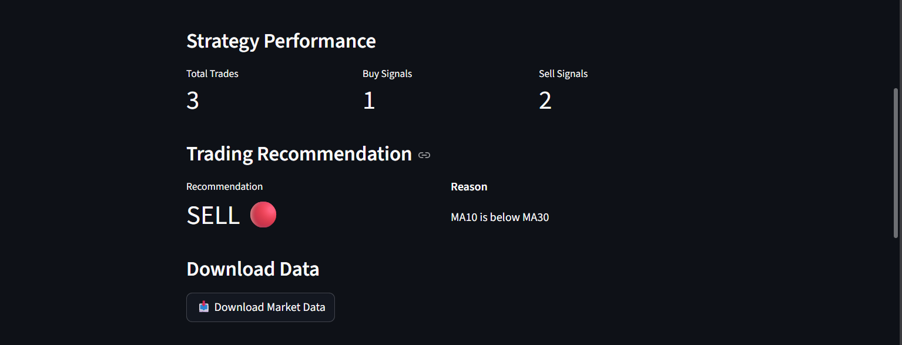

# 📈 Macro Event Tracker

A professional financial analytics dashboard built with **Python**, **Streamlit**, **Pandas**, **Plotly**, and **Yahoo Finance API**.

The application helps traders and investors monitor market behavior using technical indicators, trading signals, volatility analysis, and performance statistics through an interactive dashboard.

---

## 🚀 Features

### 📊 Interactive Market Dashboard

* Real-time ETF market data
* Supports:

  * SPY (S&P 500 ETF)
  * QQQ (NASDAQ 100 ETF)
  * DIA (Dow Jones ETF)

### 📉 Technical Analysis

* 10-Hour Moving Average (MA10)
* 30-Hour Moving Average (MA30)
* Moving Average Crossover Detection

### 🟢 Trading Signals

* Automatic BUY signal generation
* Automatic SELL signal generation
* Visual markers displayed directly on the chart

### 📈 Market Insights

* Current Price Tracking
* Market Direction Analysis
* Trend Identification
* Distance from MA10
* Strongest Macro Event Impact

### 📋 Performance Statistics

* Highest Price
* Lowest Price
* Average Price
* Monthly Return %

### ⚡ Strategy Analytics

* Total Trades Generated
* Buy Signal Count
* Sell Signal Count
* Current Strategy Status

### 🎯 Trading Recommendation Engine

* BUY / SELL recommendation
* Recommendation reasoning based on MA crossover analysis

### 🌪️ Volatility Analysis

* Rolling Volatility Calculation
* Volatility Trend Visualization

### 📥 Data Export

* Download market data as CSV
* Export for further analysis

---

# 🖼️ Dashboard Screenshots

## Main Dashboard


---

## Market Insights


---

## Performance Statistics


---

## Strategy Performance



---

## Volatility Analysis


---

# 🛠️ Tech Stack

* Python
* Streamlit
* Pandas
* Plotly
* Yahoo Finance (yFinance)
* Git & GitHub

---

# 📂 Project Structure

```text
macrotracker/
│
├── analysis/
│   ├── dashboard.py
│   └── visualize.py
│
├── api/
│   └── market_api.py
│
├── screenshots/
│   ├── dashboard.png
│   ├── market insight.png
│   ├── performance_stats.png
│   ├── strategy_performance.png
│   └── volatility_chart.png
│
├── README.md
├── requirements.txt
└── macrotracker.py
```

# ⚙️ Installation

Clone the repository:

```bash
git clone https://github.com/shreyafarsaiya/macrotracker.git
```

Move into the project directory:

```bash
cd macrotracker
```

Install dependencies:

```bash
pip install -r requirements.txt
```

Run the dashboard:

```bash
streamlit run analysis/dashboard.py
```

---

# 🎯 Key Learnings

This project demonstrates:

* Financial Data Analysis
* Data Visualization
* Technical Indicators
* Trading Signal Generation
* Dashboard Development
* Python Automation
* Git & GitHub Workflow

---

# 👩‍💻 Author

**Shreya Farsaiya**

BCA (AI & ML) Student

GitHub: https://github.com/shreyafarsaiya

LinkedIn: https://www.linkedin.com/in/shreya-farsaiya-ba8135377/

---

## ⭐ Future Improvements

* Live Macro Event Calendar
* Sentiment Analysis Integration
* AI-Based Trading Recommendations
* Portfolio Backtesting Engine
* Social Arbitrage Analytics
* Multi-Asset Support
