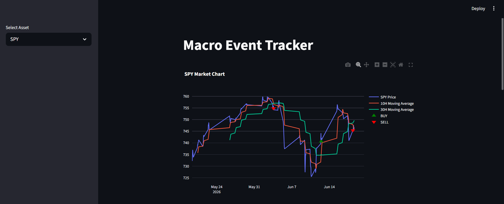
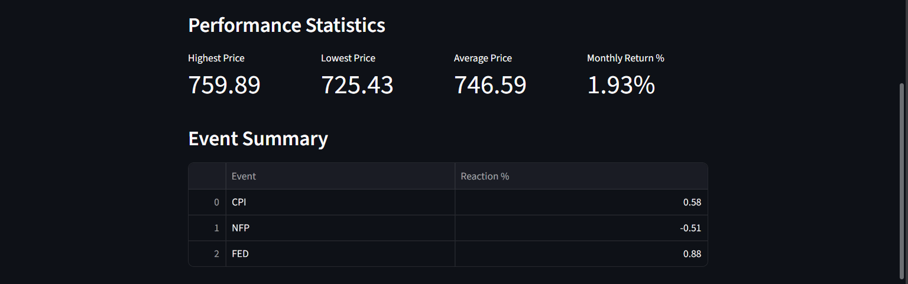
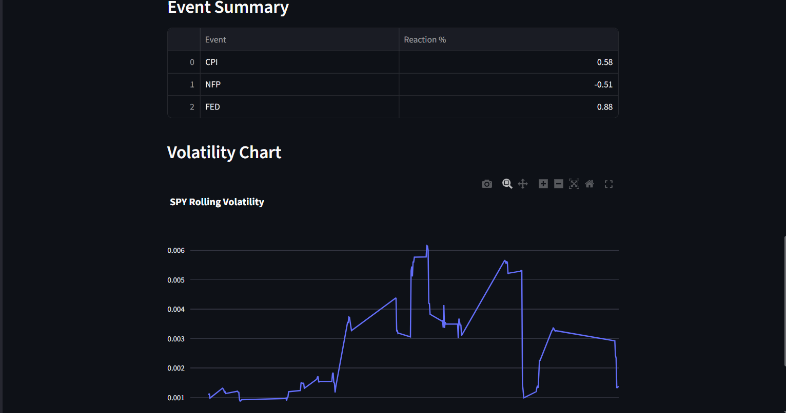

# 📈 Macro Event Tracker

A Streamlit-based financial market dashboard that analyzes ETF performance using technical indicators, volatility analysis, and moving average crossover signals.

## 🚀 Project Overview

Macro Event Tracker helps users visualize market trends and identify potential trading opportunities by combining:

* Real-time market data
* Technical indicators
* Trend analysis
* Volatility tracking
* Buy/Sell signal generation

The dashboard currently supports:

* SPY (S&P 500 ETF)
* QQQ (NASDAQ-100 ETF)
* DIA (Dow Jones ETF)

---

# 📊 Dashboard Screenshots

## Main Dashboard

Displays live asset prices with MA10 and MA30 moving averages.

---

## Market Insights

Provides trend analysis, market direction, strongest event reaction, and moving average crossover signals.

---

## Performance Statistics

Shows:

* Highest Price
* Lowest Price
* Average Price
* Monthly Return %

---

## Volatility Analysis

Tracks rolling volatility using hourly returns to measure market risk and price fluctuations.

---

# ⚙️ Features

✅ Live market data from Yahoo Finance

✅ Interactive Plotly visualizations

✅ MA10 (Short-Term Trend)

✅ MA30 (Long-Term Trend)

✅ Bullish/Bearish trend detection

✅ Moving Average Crossover Signals

✅ Buy/Sell Signal Generation

✅ Volatility Analysis

✅ Performance Statistics

✅ Streamlit Dashboard Interface

---

# 🛠️ Tech Stack

* Python
* Streamlit
* Pandas
* Plotly
* yFinance

---

# 📈 Trading Logic

### Moving Average Crossover Strategy

**Bullish Signal 🚀**

When:

MA10 > MA30

This suggests short-term momentum is stronger than the long-term trend.

**Bearish Signal 📉**

When:

MA10 < MA30

This suggests weakening momentum and potential downside risk.

---

# 🎯 What I Learned

Through this project I learned:

* Financial data analysis
* Technical indicators
* Market trend detection
* Data visualization with Plotly
* Dashboard development with Streamlit
* Git & GitHub workflow
* Project documentation

---

# 🔮 Future Improvements

* Real macroeconomic event integration
* CSV export functionality
* Signal summary panel
* Multi-asset comparison
* Strategy backtesting
* Portfolio performance tracking

---

# 👩‍💻 Author

**Shreya Farsaiya**

BCA (AI & ML) Student

Passionate about Data Analytics, Financial Markets, and AI Applications.
